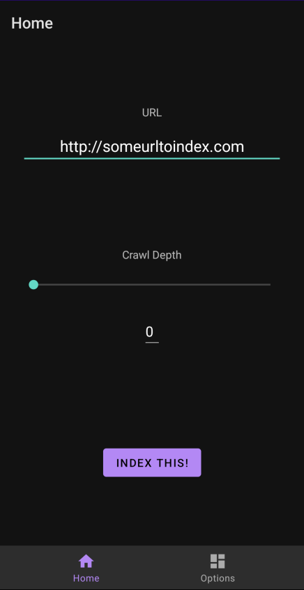
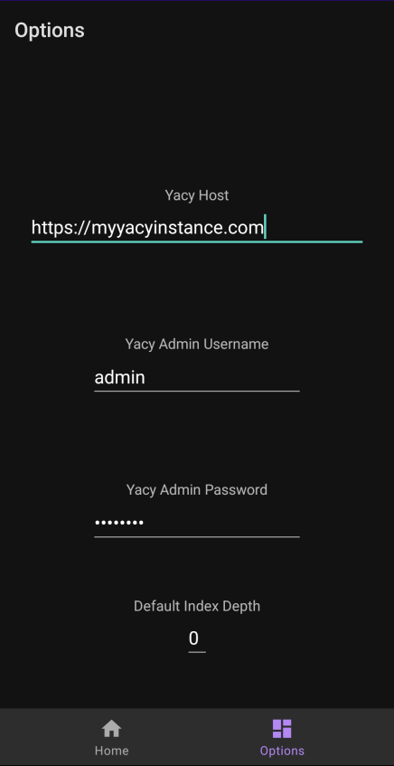
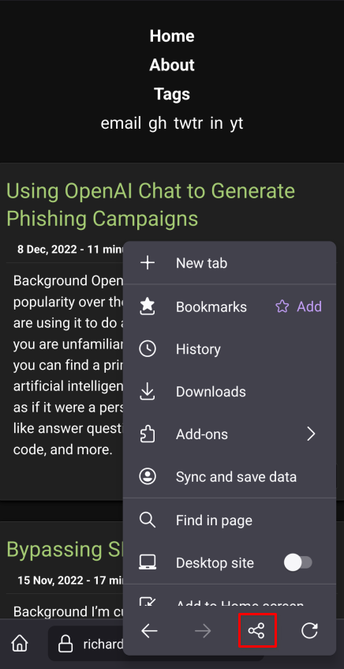
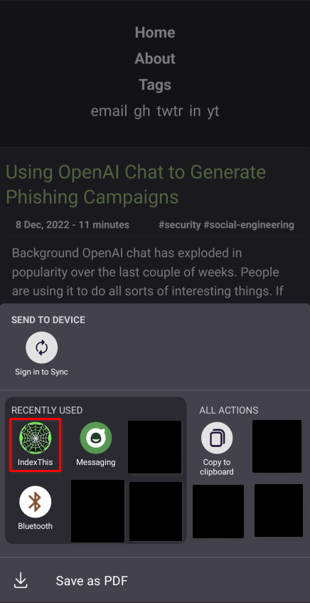
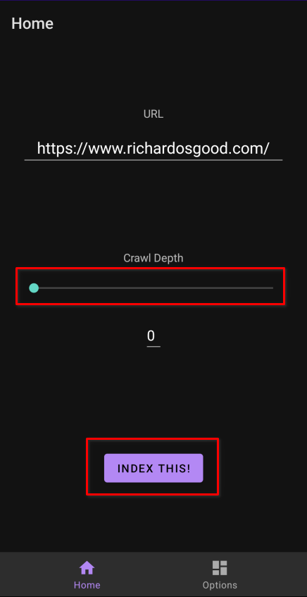

# IndexThis
IndexThis is an Android app that allows you to index a URL to a YaCy instance. You can "share" a URL from a browser or other application and choose the indexing depth. You can also manually paste a URL into IndexThis for indexing.

# Screenshots
## Home Screen

## Options Screen

# Usage
Use your browser's "share" functionality to share the current URL with the IndexThis app.
## Firefox Example
First, click the Firefox menu button.

Next, click the "share" button.

Then, choose "IndexThis"

Finally, set your index depth and click "Index This!"

## Contributions
If you find IndexThis useful and want to make changes, feel free to make a pull request. I'm trying to keep the app as simple as possible. The main area it needs help is in UI design and compatibility with other devices. I've only tested it on my Pixel 4a so far and only in portrait mode.